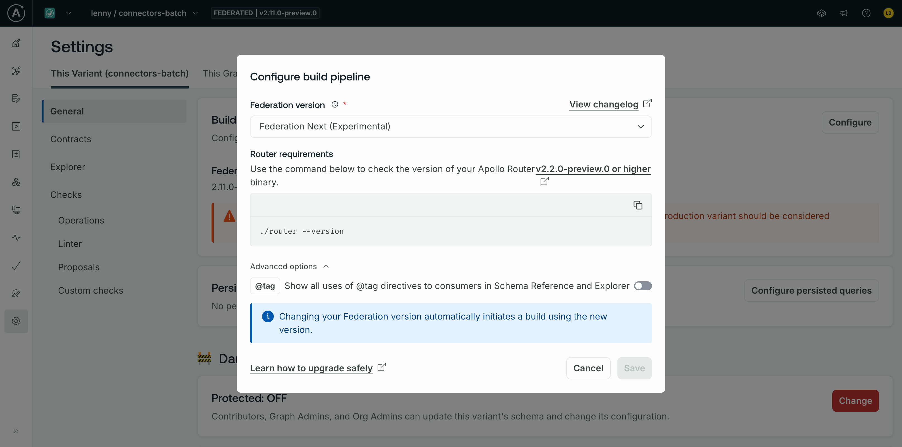

# N+1 batching with Apollo Connectors

Check out the different folders to see how entity batching works with Connectors.

* [Preview example using POST request bodies](./preview)

## Trying it out during the preview

During the preview, the following steps are required to try new features:

1. Update the `@link` directives to point to `federation/v2.11` and `connect/v0.2`:
    ```graphql
    extend schema
      @link(url: "https://specs.apollo.dev/federation/v2.11")
      @link(url: "https://specs.apollo.dev/connect/v0.2", import: ["@source", "@connect"])
    ```
2. Opt into the preview with this router YAML configuration:
    ```yaml
    connectors:
      preview_connect_v0_2: true
    ```
3. Use Router v2.2.0-preview.0
    ```sh
    export APOLLO_ROVER_DEV_ROUTER_VERSION=2.2.0-preview.0
    rover dev
    ```
4. Use Federation 2.11.0-preview.0 for composition:
    - In `supergraph.yaml`:
        ```yaml
        federation_version: =2.11.0-preview.0
        subgraphs:
          products:
            # ...
        ```
    - In GraphOS, choose the "Federation Next" build pipeline version from the Variant settings page:
        

**The code in this repository is experimental and has been provided for reference purposes only. Community feedback is welcome but this project may not be supported in the same way that repositories in the official [Apollo GraphQL GitHub organization](https://github.com/apollographql) are. If you need help you can file an issue on this repository, [contact Apollo](https://www.apollographql.com/contact-sales) to talk to an expert, or create a ticket directly in Apollo Studio.**
