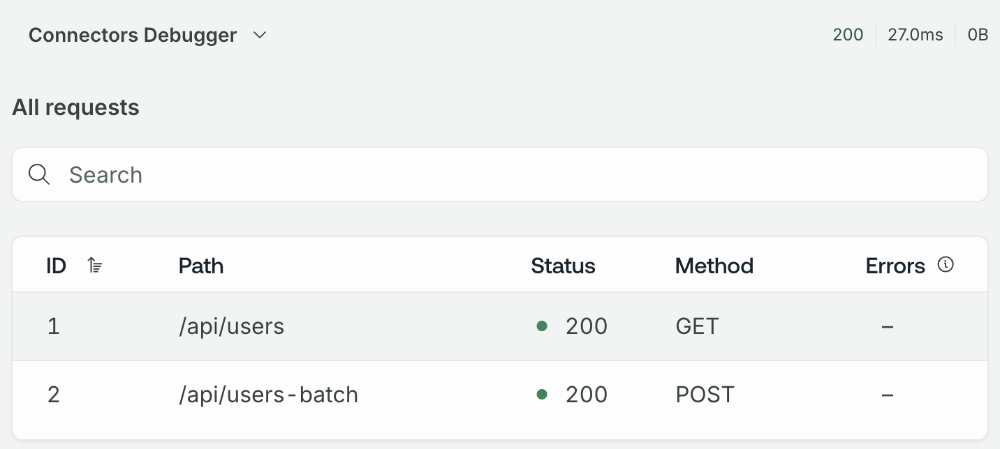

# POST body example

```sh
deno run --allow-net=0.0.0.0:4001 --watch api.ts
```

```sh
export APOLLO_KEY=<your api key>
export APOLLO_GRAPH_REF=<your graph ref>
export APOLLO_ROVER_DEV_ROUTER_VERSION=2.3.0-preview.0
rover dev --supergraph-config supergraph.yaml --router-config router.yaml
```

```graphql
query Query {
  users {
    id
    name
    username
  }
}
```



To see more examples of batch patterns, including comma-separated values and repeated query params, add the `email` and `website` fields to the operation, which are resolved by different connectors/endpoints.

```graphql
query Query {
  users {
    id
    name
    username
    email # repeated query params, i.e. ?id=1&id=2
    website # comma-separated values, i.e. ?ids=1,2,3 (and with a max batch size!)
  }
}
```
